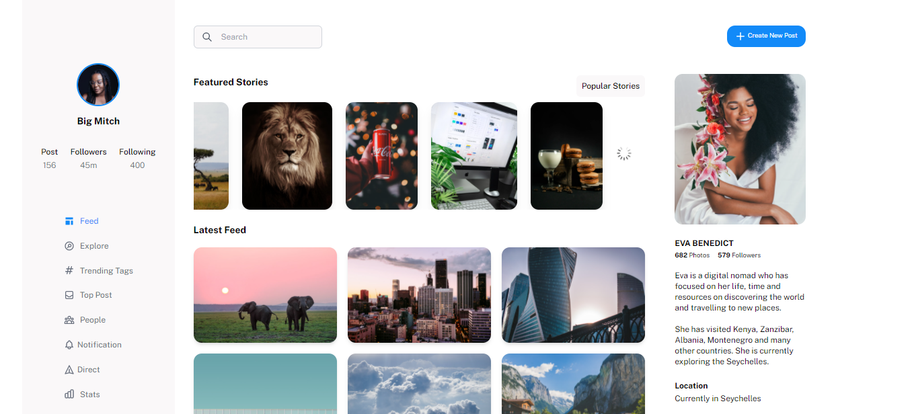

### SOCIAL DASHNOARD UI

---

Interface developed using React Js, Next Js, Tailwind Css

---



#### project hosted on vercel [hosting](https://social-dashboard-eight.vercel.app/)

---

#### Installation

clone the project

```bash
git clone https://github.com/ryanmwakio/social-dashboard.git
```

#### install all dependencies:

Navigate into the project either through terminal or IDE then run

```
npm install
```

After all dependencies have been installed then run:

```bash
npm run dev
```

An instance of the app should run on localhost:3000 or [http://127.0.0.1:3000](http://127.0.0.1:3000)

---

To be able to run the project using an instance of any server then navigate into the project and run:

```bash
npm run build
```

The command will build the project such that it can be served using any server. This has to be done because Next js facilitates for both SSG and SSR during rendering.
With this done you can now run

```bash
 npm start
```

or point a server to the static files generated
